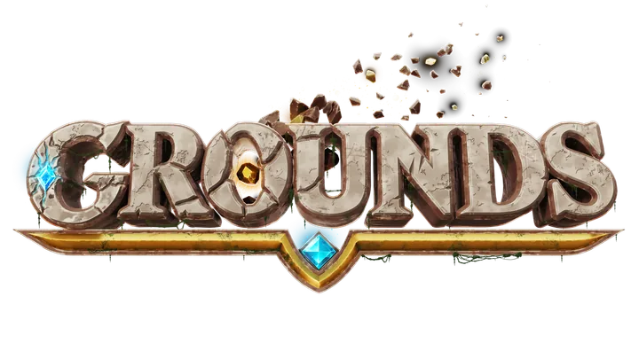

  

**Grounds** is building the foundation for the next generation of multiplayer experiences - a connected platform for creators, developers, and players.

Our mission is to make high-quality game infrastructure, tools, and worlds accessible to everyone.

### What We're Building

- **Platform orchestration** - control-plane APIs, preview environments, release bundles, and deployment workflows for multiplayer experiences
- **Cloud-native infrastructure** - Kubernetes, Agones, Helm, Pulumi, container images, and local development environments
- **Minecraft services and plugins** - identity, player data, configuration, status, routing, chat, social, and server lifecycle integrations
- **Creator and operator tools** - browser dashboards, CLIs, Gradle tooling, documentation, and distribution channels
- **Shared platform libraries** - gRPC contracts, build conventions, reusable infrastructure modules, and game-facing APIs

### Vision

A global platform where creativity and technology meet, bridging players and creators across regions, genres, and worlds.

### Learn More

[grounds.gg](https://grounds.gg)  
[hi@grounds.gg](mailto:hi@grounds.gg)

© Grounds. All rights reserved.
